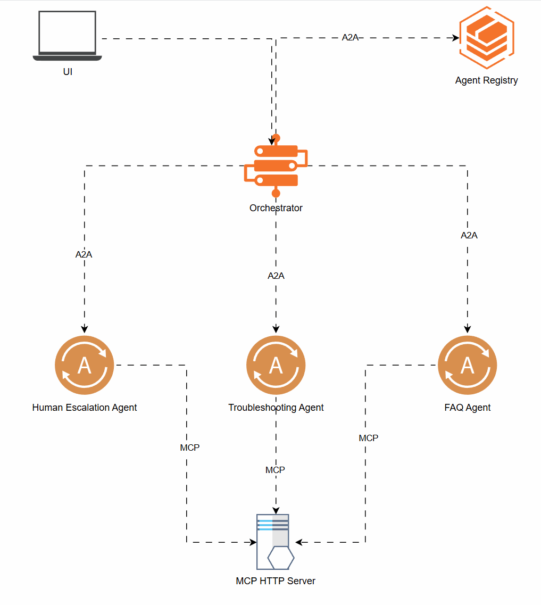

# SK A2A MCP - Agent-to-Agent Demo with Model Context Protocol

A reference architecture demonstration that showcases the integration of Google's Agent-to-Agent (A2A) protocol with Anthropic's Model Context Protocol (MCP) for building multi-agent systems. This project implements a customer support system with specialized agents that communicate using A2A while leveraging MCP for tool access.

<br/>
<br/>



## Features

- **Orchestrator Agent**: Routes customer queries to specialized agents based on content
- **FAQ Agent**: Answers common questions using a knowledge base
- **Technical Troubleshooting Agent**: Diagnoses and resolves technical issues
- **Human Escalation Agent**: Manages escalation to human support with case creation
- **MCP Tools Server**: Provides function-calling capabilities to all agents

## Requirements

- Windows with PowerShell
- Python 3.9+ with virtual environment
- Required Python packages (specified in requirements.txt)

## Project Structure

```
sk_a2a_mcp/
├── app/                      # Agent implementations
│   ├── orchestrator_agent.py
│   ├── faq_agent.py
│   ├── technical_troubleshooting_agent.py
│   ├── human_support_escalation_agent.py
│   ├── mcp_tools_server.py
│   └── cli-output/           # Log output directory
├── ui/                       # User interface
│   ├── chat.py               # Chainlit UI implementation
│   └── app_client.py         # Client to connect to agents
├── start_all_agents.ps1      # PowerShell script to start agents
├── stop_all_agents.ps1       # PowerShell script to stop agents
└── .venv/                    # Virtual environment (create this)
```

## Setup

1. Clone the repository:
   ```
   git clone https://github.com/samelhousseini/sk_a2a_mcp.git
   cd sk_a2a_mcp
   ```

2. Create and activate a virtual environment:
   ```
   python -m venv .venv
   .\.venv\Scripts\activate
   ```

3. Install requirements:
   ```
   pip install -r requirements.txt
   ```

## Using the PowerShell Scripts to Manage Agents

The project includes PowerShell scripts to start and stop all or individual agents easily.

### Starting Agents

The start_all_agents.ps1 script provides several options:

```powershell
# Start all agents
.\start_all_agents.ps1

# Start a specific agent only
.\start_all_agents.ps1 -AgentName FAQ
.\start_all_agents.ps1 -AgentName Orchestrator
.\start_all_agents.ps1 -AgentName TechTroubleshooting
.\start_all_agents.ps1 -AgentName HumanEscalation
.\start_all_agents.ps1 -AgentName MCPServer

# Restart all agents
.\start_all_agents.ps1 -Restart

# Restart a specific agent
.\start_all_agents.ps1 -AgentName FAQ -Restart
```

When starting all agents, the script will:
1. Start the MCP Tools Server first (port 8010)
2. Start the helper agents (FAQ, TechTroubleshooting, HumanEscalation)
3. Finally start the Orchestrator agent

The script provides feedback and creates log files in the cli-output directory.

### Stopping Agents

The stop_all_agents.ps1 script stops running agents:

```powershell
# Stop all agents
.\stop_all_agents.ps1

# Stop a specific agent
.\stop_all_agents.ps1 -AgentName FAQ
.\stop_all_agents.ps1 -AgentName Orchestrator
.\stop_all_agents.ps1 -AgentName TechTroubleshooting
.\stop_all_agents.ps1 -AgentName HumanEscalation
.\stop_all_agents.ps1 -AgentName MCPServer
```

### Checking Agent Status

You can check the status of agent jobs using PowerShell commands:

```powershell
# Check status of all jobs
Get-Job

# View output from a specific agent
Receive-Job -Name Python_FAQ_Agent -Keep
```

## Starting the UI

After starting all the agents, you can run the Chainlit UI to interact with the system:

1. Make sure all agents are running (verify with `Get-Job` command)

2. Run the Chainlit application:
   ```
   cd ui
   chainlit run chat.py -w --port 8080
   ```

3. Open your browser and navigate to: http://localhost:8080

4. Start chatting with the system. Example queries:
   - "What are your business hours?" (FAQ)
   - "My internet is not working" (Technical Troubleshooting)
   - "I need to speak with a human agent" (Human Escalation)

The UI provides a chat interface that connects to the Orchestrator agent, which then routes your queries to the appropriate specialized agent based on content analysis.

## Architecture Details

The system works as follows:

1. **User Interface (UI)**: Sends user queries to the Orchestrator agent
2. **Orchestrator Agent**: Analyzes queries and routes them to specialized agents:
   - FAQ Agent: For general product questions and information
   - Technical Troubleshooting Agent: For technical problems requiring troubleshooting
   - Human Escalation Agent: For issues requiring human intervention
3. **MCP Tools Server**: Provides specialized functions to agents through the Model Context Protocol
4. **Agent-to-Agent Communication**: Agents communicate using Google's A2A protocol

All agents run as separate services on different ports:
- Orchestrator: 8000
- FAQ Agent: 8001 
- Technical Troubleshooting: 8002
- Human Escalation: 8003
- MCP Tools Server: 8010

## Troubleshooting

- **Agents not starting**: Check the log files in the cli-output directory
- **Connection issues**: Ensure all ports are available and not blocked by firewall
- **UI not connecting**: Verify all agents are running with `Get-Job` command

## License

This project is licensed under the MIT License